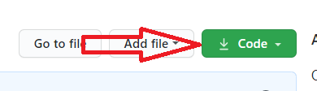

# OOP345-NAA-Notes
## Active Session
You are welcome to join the session as a guest by **using your real Seneca Name** (what is on your student card), otherwise you will be kicked out. Click on the link below to join: (find active session hours in my schedule below) <br />
[OOP345 active Session by Fardad](https://connect.rna2.blindsidenetworks.com/invite/to?c=xqvnXZQ87ksucvgZtKvKfDN5TiD0nHU_Y7OqPsnj908&m=e8ce43f1a730e2478fa56e6d96881e945f6e186d&t=1613737739237&u=senecacollege)
## Previous Sessions
- [Jan 15 - C++ Overview, Compilation, Execution](https://recordings.rna2.blindsidenetworks.com/senecacollege/96f0b46aa442de771ce25d9e6f10f4dcf5368ba4-1610714847716/capture/)
- [Jan 19 - C++ Overview, Compilation and Execution & Q&A](https://recordings.rna2.blindsidenetworks.com/senecacollege/96f0b46aa442de771ce25d9e6f10f4dcf5368ba4-1611080851821/capture/)
- [jan 22 - Pointers, References, and Arrays, Classes and Scoped Enumeration](https://recordings.rna2.blindsidenetworks.com/senecacollege/96f0b46aa442de771ce25d9e6f10f4dcf5368ba4-1611319676921/capture/)
- [jan 26 - Pointers, References, and Arrays, Classes and Scoped Enumeration (continued)](https://recordings.rna2.blindsidenetworks.com/senecacollege/96f0b46aa442de771ce25d9e6f10f4dcf5368ba4-1611685660638/capture/)
- [Feb 02 - Inheritance and Templates](https://recordings.rna2.blindsidenetworks.com/senecacollege/96f0b46aa442de771ce25d9e6f10f4dcf5368ba4-1612290420225/capture/)
- [Feb 05 - Compositions, Aggregations, and Associations](https://recordings.rna2.blindsidenetworks.com/senecacollege/96f0b46aa442de771ce25d9e6f10f4dcf5368ba4-1612529898873/capture/)
- [Feb 09 - Expressions](https://recordings.rna2.blindsidenetworks.com/senecacollege/96f0b46aa442de771ce25d9e6f10f4dcf5368ba4-1612895470874/capture/)
- [Feb 12 - Funcitons](https://recordings.rna2.blindsidenetworks.com/senecacollege/96f0b46aa442de771ce25d9e6f10f4dcf5368ba4-1613133818484/capture/)
- [Feb 16 - Functions(Continued)](https://recordings.rna2.blindsidenetworks.com/senecacollege/96f0b46aa442de771ce25d9e6f10f4dcf5368ba4-1613500295816/capture/)
- [Feb 19 - Functions review, exceptions](https://recordings.rna2.blindsidenetworks.com/senecacollege/96f0b46aa442de771ce25d9e6f10f4dcf5368ba4-1613737739275/capture/)

## Fardad's Schedule
| Period | Start-Stop  | Mon    | Tue            | Wed        | Thu     | Fri      |
|--------|-------------|--------|----------------|------------|---------|----------|
| 1      | 8:00-8:50   |        |                |            |         |OOP345 NAA Lecture|
| 2      | 8:55-9:45   |        |                |            |         |OOP345 NAA Lecture|
| 3      | 9:50-10:40  |        |OOP244 NAA (Lecture/Q&A)|            |         |OOP244 NAA Lecture|
| 4      | 10:45-11:35 |        |OOP244 NAA (Lecture/Q&A)|            |         |OOP244 NAA Lecture|
| 5      | 11:40-12:30 |        |OOP244 NBB (Lecture/Q&A)| [Office]() |         |           |
| 6      | 12:35-13:25 |        |OOP244 NBB (Lecture/Q&A)| [Office]() |         |OOP244 NBB Lecture|
| 7      | 13:30-14:20 |        |OOP345 NAA (Lecture/Q&A)|            |         |OOP244 NBB Lecture|
| 8      | 14:25-15:15 |        |OOP345 NAA (Lecture/Q&A)|            |         |          |
| 9      | 15:20-16:10 |        |                |            |         |          |
| 10     | 16:16-17:05 |        |                |            |         |          |
| 11     | 17:10-18:00 |        |                |            |         |          |
| 12     | 18:05-18:55 |        |                |            |         |          |

## Setting up your computers for OOP345

Installation guides for preparing your computer for the subject can be found in this playlist on YouTube:<br />
[Seneca-SDDS "how to" videos for C/C++ Core subjects](https://www.youtube.com/playlist?list=PLxB4x6RkylosAh1of4FnX7-g2fk0MUeyc)<br />
OR:<br />
Go to this url: https://tinyurl.com/244setup 


## Getting Workshop files
(if you have not followed the Installation guides to prepare your computer go to **Using [Download Zip](#using-download-zip)**)<br />

### Using [Git](https://git-scm.com/download/win)
- Open https://github.com/Seneca-244200/OOP-Workshops and click on “Code” Button; this will open “Clone with HTTPS” window.<br />

> If the window is titled “Clone with SSH” then click on “Use HTTPS”: <br />

- Copy the https URL by clicking on the button on the right side of the URL:<br />
- Open File Explorer on your computer and select or create a directory for your workshops.
#### Using [ToroiseGit](https://tortoisegit.org/download/)
- Right click on the selected directory and select “Git Clone":<br /> <br />
-This will open the “Git Clone” window with the URL already pasted in the “URL” text box; if not, paste the URL manually:<br /> <br />
- Click on ok<br />
This will create on your computer a clone (identical directory structure) of the directory on Github.  Once you have cloned the directory, you can open the workshop directory **OOP-Workshops/WS??** and start doing your workshop. Note that you will repeat this process for all workshops and milestones of your project in this subject.
> If your professor makes any changes to the workshop or a new workshop is released, you can right click on the cloned repository directory and select **Tortoise Git/pull** to update and sync your local workshops repositoryy to the one on Github with-out having to download it again. Note that this will only apply the changes made and will not affect any work that you have done on your workshop.
#### Using Command line
- Open the git command line on your computer.
- Change the directory to your workshops directory.
- Issue the following command at the command prompt in your workshops directory: 
``` bash
git clone https://github.com/Seneca-244200/OOP-Workshops.git<ENTER>
```
> The URL for all the workshops are the same throughout the semester. The only thing that changes, is the workshop number.<br/>

This will create a clone (that is an identical directory structure and content to the one Github) of the OOP-Workshops repository on your computer.  Once you have cloned the directory, you can open the subdirectory the workshop and start doing your work. Note that you will repeat this process for all workshops and milestones of your project in this subject.

> If your professor makes any changes to the workshop, you can issue the command
``` bash 
git pull<ENTER>
``` 
>  in the cloned repository directory to update and sync your local workshop to the one on Github without having to download it again. Note that this will only apply the changes made and will not affect any work that you have done on your workshop.

#### Using Download ZIP
- Open https://github.com/Seneca-244200/OOP-Workshops  and click on “Code” button and click on “Download ZIP”.<br />
<br />
- This will download a zipped file copy of the workshop repository from Github to your computer. You can extract this file to where you want to do your workshop. <br />
> Note that, if your professor makes any changes to the workshop, to get them you have to separately download another copy of the workshop and manually apply the changes to your working directory to **make sure nothing of your work is overwritten by mistake**.
